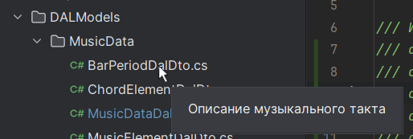
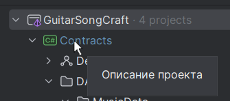
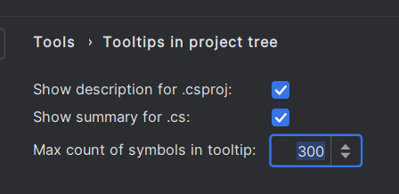

# ShowProjectTreeTooltips for Rider

This plugin allows to see tooltips with short description of projects 
and C# files in .sln project tree in Rider.

- **.csproj files**: tag "Description" in .csproj
- **C# files**: first tag "summary" in .cs files which will be found before "class", "interface" and other c# types

It can be configured in settings (**File → Settings → Tools → Tooltips in project tree**)

## Example of work

### Tooltip for `.cs` file:

### Tooltip for `.csproj`:

### Settings

## Installation

Install plugin + Java 17 (or later)

## Development

I used this template and followed the instructions: https://github.com/JetBrains/resharper-rider-plugin